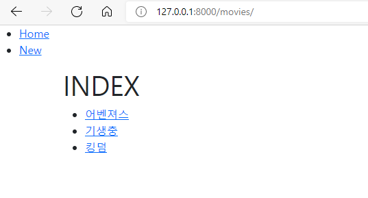
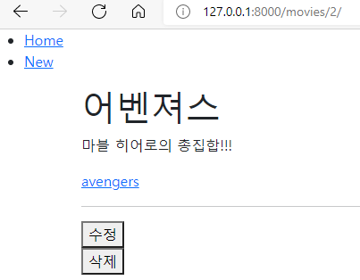
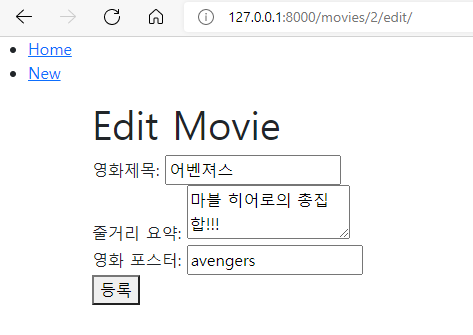
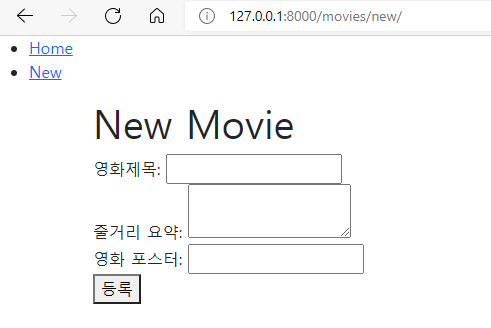

# Project 04 Readme

프레임 워크 기반 웹페이지 구현 

## A. 프로젝트 구조

프로젝트 구조를 구현하는 것은 일주일동안 많이 해봐서 큰 어려움이 없었다. 

## B. Model

모델을 설정하는 것도 문제에 제시된 대로 진행하면 되는 것이라 큰 어려움이 없었다. 

## C. Admin

Admin을 만들어 주는 것도 크게 어렵지 않았다. 

## D. URL

URL을 선언하는 것부터 난이도가 올라갔다. 제대로 선언하지 않으면 url이 꼬이게 되어 오류가 나기 때문이다. 이번 프로젝트를 하면서 2가지 실수를 했는데 그 중 하나가 url선언할 때 낸 오타였다. 눈에도 잘 보이지 않아서 이를 해결하려고 굉장히 애를 먹었다. 

## E. View & Template

 index 창이다. 오류를 찾느라 시간을 많이 써서 꾸미지는 못했다. 사실 이 인덱스 창을 만드는데 자꾸 NoReverseMatch 오류가 나서 굉장히 애를 먹었다. 오류가 존재한다고 알려주는 부분을 주석처리를 해도 계속 오류가 났기 때문이다. 하지만 이유를 알 수 없게도 갑자기 오류가 해결되서 좋기는 한데 찝집했다. 

상세 설명을 해주는 detail창이다. 역시 꾸미질 못해서 아쉽다. 하지만 수업 내용을 다시 보면서 따라가니 크게 어렵지 않았다. 

내용을 수정할 수 있는 edit창이다. 업데이트 관련 url 오타때문에 여기서 등록 버튼을 누르면 나타나는 오류로 애를 먹었다. 오타 실수를 줄일 수 있도록 최선을 다해야겠다는 생각을 하게 되었다. 

새 영화를 등록할 수 있는 new창이다. views.py와 html에서 코딩을 짜는 것이 크게 어렵지 않았다. 

## F. 결론

문제를 풀기는 했지만 오류가 나던 것이 갑자기 해결되었다는 게 살짝 찝찝하긴 했다. 그렇지만 이번 프로젝트를 통해서 일주일동안 배운 장고에 대해서 이해할 수 있어서 굉장히 유익했다. 사실 이번주에 배운 내용에 대해서 중간중간 이해하기 어려운 부분들이 있었는데 이번 프로젝트를 통해서 해결할 수 있었다. 

