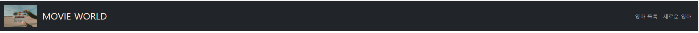
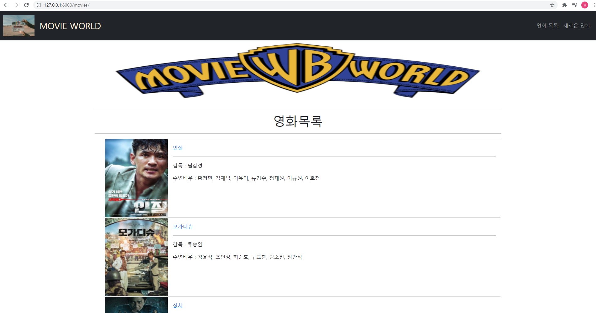
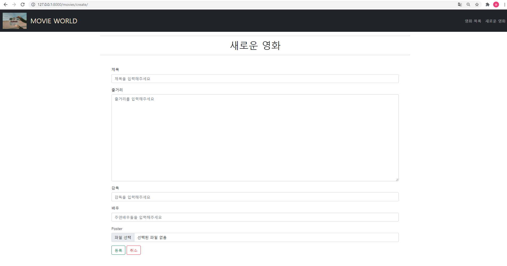
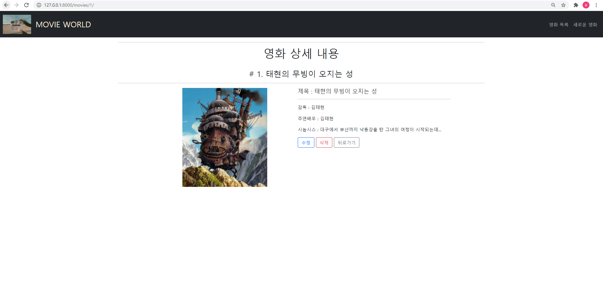

# README

## Problem

### Django Project

1. 목표

- 데이터를 생성, 조회, 수정, 삭제할 수 있는 Web application 제작 
-  Django web framework를 통한 데이터 조작 
- ORM(Object Relational Mapping)에 대한 이해
- Django ModelForm을 활용한 HTML과 사용자 요청 데이터 유효성 검증

2. 요구사항

커뮤니티 서비스의 게시판 기능 개발을 위한 단계로, 영화 데이터의 생성, 조회, 수정, 삭제 가능한 어플리케이션을 완성합니다. 해당 기능은 향후 커뮤니티 서비스의 필수 기능으로 사용됩니다.


## 코드 작성 과정

### A. 프로젝트 구조 만들기 및 기본설정

1. 가상환경을 설정하고 필요한 pip들을 다운 받는다. 

```bash
$ python -m venv venv
$ source venv\Scripts\activate
$ pip install django django-extensions django-bootstrap-v5
$ pip freeze > requirements.txt
```


2. git bash 터미널 창에 프로젝트와 애플리케이션을 만든다.

```bash
$ django-admin startproject pjt05 .
$ python manage.py startapp movies
```

```python
# pjt05/settings.py

INSTALLED_APPS =[
	# 애플리케이션
	'movies',
	# 3rd-party 
	'django_extensions',
	'bootstrap5',
	...
]
```


3. templates를 읽기 위해 템플릿 경로 설정

```python
# pjt05/settings.py

TEMPLATES = [
	{	
		....
		'DIRS': [BASE_DIR / 'templates'],
		....
	},	
]
```

- base.html을 가지고 있는 templates파일을 프로젝트와 애플리케이션과 같은 위치에 만들기 때문에 앱 이외의 경로도 탐색할 수 있게 설정


4. STATIC과 MEDIA를 위한 경로 설정

```python
# pjt05/settings.py

...
STATIC_URL = '/static/'

STATICFILES_DIRS = [
    BASE_DIR / 'static',
]

MEDIA_ROOT = BASE_DIR / 'media'
MEDIA_URL = '/media/'
...
```

- 영화 포스터를 넣기 위해서 장고가 static 파일과 Media도 탐색할 수 있도록 이를 설정해주었습니다. 


5. 추가 설정

```python
LANGUAGE_CODE = 'ko-kr'

TIME_ZONE = 'Asia/Seoul'
```

- 언어와 시간을 한국으로 설정하기 위해 위와 같이 코드 작성


### B. Model을 작성

1. 모델 클래스의 이름은 Movie이다. 

```python
# movies/models.py

from django.db import models

class Movie(models.Model):
   title = models.CharField(max_length=100)
   overview = models.TextField()
   director = models.CharField(max_length=30)
   actor = models.CharField(max_length=100)
   poster = models.ImageField(blank=True) 

   def __str__(self):
       return self.title
```

- 제목, 줄거리, 포스터 이후 감독과 주연배우도 추가해주었습니다.


2. 설정한 모델 클래스를 db에입력하기 위해 migrate설정

```bash
$ python manage.py makemigrations
$ python manage.py migrate
```

- 장고가 모델에 생긴 변화를 DB에 반영할 수 있도록 migrate를 했습니다.


### C. Form 작성

1. ModelForm을 통해 Form의 틀을 설정

```python
# Movies/forms.py

from django import forms
from .models import Movie

class MovieForm(forms.ModelForm):
    title = forms.CharField(
        label = '제목',
        widget = forms.TextInput(
            attrs = {
                'maxlength': 100,
                'placeholder': '제목을 입력해주세요',
            }
        ),
    )
    overview = forms.CharField(
        label = '줄거리',
        widget = forms.Textarea(
            attrs = {
                'placeholder': '줄거리를 입력해주세요',
                'rows': 15,
                'cols': 150,
            }
        ),
    )
    director = forms.CharField(
        label = '감독',
        widget = forms.TextInput(
            attrs = {
                'maxlength': 30,
                'placeholder': '감독을 입력해주세요',
            }
        ),
    )
    actor = forms.CharField(
        label = '배우',
        widget = forms.TextInput(
            attrs = {
                'maxlength': 100,
                'placeholder': '주연배우들을 입력해주세요',
            }
        ),
    )

    class Meta:
        model = Movie
        fields = '__all__'
```

- forms.py는 애플리케이션에 기본적으로 존재하는 파일이 아니라서 앱 안에 이를 생성

- `from django import forms`, `from .models import Movie`을 통해 장고에서 제공하는 forms 모델과 Model에서 설정한 Movie 클래스를 가져왔습니다. 

- 이후 title(제목), Overview(줄거리), director(감독), Actor(배우)에 대한 형식들을 설정해주었습니다.


### D. Admin 페이지 만들기

1. admin.py 설정

```python
# movies/admin.py

from django.contrib import admin
from .models import Movie

# Register your models here.
admin.site.register(Movie)
```

- admin 페이지에서 모델의 클래스를 불러올 수 있도록 `from .models import Movie`를 넣어주었습니다.


2. 관리자 계정 만들기

```bash
$ python manage.py createsuperuser
```

- git bash 터미널 창에서 위와 같은 명령어를 입력

- 아이디와 비밀번호는 admin으로 설정, 이메일은 넘어감

- 보안 문제때문에 경고창이 나오지만 연습 프로젝트임으로 'y'를 입력했습니다.


### E. URL

1. 프로젝트 URL에서 애플리케이션 URL로 연결

```python
# Pjt05/urls.py

from django.contrib import admin
from django.urls import path, include
from django.conf import settings
from django.conf.urls.static import static

urlpatterns = [
    path('admin/', admin.site.urls),
    path('movies/', include('movies.urls')),
] + static(settings.MEDIA_URL, document_root=settings.MEDIA_ROOT)
```

- 코드 중복을 피하고 관리의 용이를 위해 프로젝트뿐만 아니라 앱에도 urls.py를 만듦

- 프로젝트의 urls.py에서 앱의 urls.py로 경로를 연결해주기 위해 `include`를 사용

- static파일을 탐색하기 위해 `from django.conf import settings`, `from django.conf.urls.static import static`, `+ static(settings.MEDIA_URL, document_root=settings.MEDIA_ROOT)`를 입력해주었습니다.


2. 애플리케이션 urls.py 설정

```python
# movies/urls.py

from django.urls import path
from . import views

app_name = 'movies'
urlpatterns = [
    path('create/', views.create, name = 'create'),
    path('', views.index, name = 'index'),
    path('<int:pk>/', views.detail, name = 'detail'),
    path('<int:pk>/update/', views.update, name = 'update'),
    path('<int:pk>/delete/', views.delete, name = 'delete'),
]
```

- 프로젝트의 url과 연결하고 views.py를 연결하도록 `from django.urls import path`, `from . import views`로 설정

- app_name을 설정해주어 namespace오류가 나지 않도록 함
- create, index, detail, update, delete에 해당하는 path를 작성해주었습니다.


### F. View & Template

1. 공유 템플릿 생성 

```django
{# templates/base.html #}



<!DOCTYPE html>
<html lang="en">
<head>
  <meta charset="UTF-8">
  <meta http-equiv="X-UA-Compatible" content="IE=edge">
  <meta name="viewport" content="width=device-width, initial-scale=1.0">
  
  <title>Document</title>
</head>
<body>
  
  <div class="container">
  
  </div>

</body>
</html>
```

- base.html은 프로젝트와 애플리케이션과 동일선상 위치한 templates파일에 넣었다. 
- 장고 부트스트랩을 적용하기 위해 ``을 가장 처음에 작성하고 ``, ``를 작성
- navbar를 다 적으면 코드가 길어지기 때문에 nav.html을 따로 작성한 후에  ``로 불러온다. 
- body 부분을 container 클래스로 선언해서 웹 상에서 벽에 붙지 않게 해주었습니다. 



```django
{# templates/nav.html #}

<nav class="navbar navbar-expand-md navbar-dark bg-dark sticky-top">
  <div class="container-fluid d-flex justify-content-between">
    <a class="navbar-brand" href=""></a>
    <h3 class="m-0" style="color:antiquewhite">MOVIE WORLD</h3>
    <button class="navbar-toggler" type="button" data-bs-toggle="collapse" data-bs-target="#navbarNav" aria-controls="navbarNav" aria-expanded="false" aria-label="Toggle navigation">
      <span class="navbar-toggler-icon"></span>
    </button>
    <div class="collapse navbar-collapse justify-content-end" id="navbarNav">
      <ul class="navbar-nav">
        <li class="nav-item">
          <a class="nav-link" href="">영화 목록</a>
        </li>
        <li class="nav-item">
          <a class="nav-link" href="">새로운 영화</a>
        </li>
    </div>
  </div>
</nav>
```

- navbar는 bootstrap사이트에서 코드를 복사해왔다.
- 영화와 관련한 게시판이기 때문에 navbar의 요소를 게시판 이름(MOVIE WORLD), 영화목록, 새로운 영화로 작성
- 각 요소를 클릭했을 때 각각에 해당하는 페이지로 이동할 수 있도록 \<a>로 연결
- 추가적으로 이미지를 삽입해서 디자인을 적용했습니다.


[참고] views.py에 사용할 라이브러리 import

```python
# movies/urls.py
from django.shortcuts import render,redirect, get_object_or_404
from django.views.decorators.http import require_http_methods, require_POST, require_safe
from django.core.paginator import Paginator
from .models import Movie
from .forms import MovieForm
```


2. 전체 영화 목록 조회




```python
# movies/views.py
@require_safe
def index(request):
    movies = Movie.objects.order_by('-pk')
    paginator = Paginator(movies, 3)
    page_number = request.GET.get('page')
    page_obj = paginator.get_page(page_number)
    context = {
        'page_obj':page_obj,
    }
    return render(request, 'movies/index.html', context)
```

- `@require_safe`를 이용하여 GET방식의 데이터만 불러오도록 했습니다.
- `movies = Movie.objects.order_by('-pk')` 코드를 통해 나중에 등록된 것이 먼저 보이도록 설정
- `paginator = Paginator(movies, 3)` 코드를 통해 한 페이지에 3개의 데이터만 보여줄 수 있도록 설정

```django
{# movies/templates/movies/index.html #}





  
  <hr>
  <h1 class="text-center">영화목록</h1>
  <hr>
  <ul>
    
      <div class="card flex-row" style="width:100%;">
        
          
        
          <p>업로드된 포스터 없습니다.</p>
        
        <div class="card-body">
          <a href="">{{ movie.title }}</a>
          <hr>
          <p class="card-text">감독 : {{ movie.director }}</p>
          <p class="card-text">주연배우 : {{ movie.actor }}</p>
        </div>
      </div>
    
  </ul>
  <div class="d-flex justify-content-center">
    
  </div>

```

- 모든 movies/templates/movies/ 안의 html 파일들은 제일 상단에 ``을 작성하여 base.html을 확장합니다.
- ``, ``을 통해서 bootstrap요소와 static 파일을 사용가능하도록 하였습니다.
- ``, index.html의 제일 처음에는 static file(이미지)을 불러왔습니다.
- 조건문을 통해 poster 이미지가 있으면 style에 맞춰 poster를 출력하고, 이미지가 없다면 '업로드된 포스터가 없습니다.'라는 문구를 출력합니다.
- 각각의 영화는 `class=card`를 통해 각각 card 형식으로 출력되도록 하였습니다.
- 작성했던 pagination을 ``를 통해 적용시킵니다.


3. 새로운 영화 작성 (GET/POST)



```python
# movies/views.py
@require_http_methods(['GET','POST'])
def create(request):
    if request.method == 'POST':
        form = MovieForm(data=request.POST, files=request.FILES)
        if form.is_valid():
            movie = form.save()
            return redirect('movies:detail', movie.pk)
    else:
        form = MovieForm()
    context = {
        'form':form,
    }
    return render(request, 'movies/create.html', context)
```

- `@require_http_methods(['GET','POST'])`를 통해 GET과 POST방식으로만 데이터를 받음을 명시합니다.
- request.method가 POST인지 GET인지에 따라 폼클래스의 인스턴스를 처리하는 방식은 다릅니다. 
- **POST형식**으로 들어올 경우, 
  - `data=request.POST`를 인자로 넣어 폼 인스턴스 생성하고, 이미지 파일의 경우 FILES에 저장되기 때문에 `files=request.FILES`로 이미지 파일을 가져옵니다.
  - 작성된 폼 인스턴스는 `is_vaild()`를 통해 유효성 검사를 하며, 문제가 없으면 DB에 저장되고 상세 영화 페이지로 이동됩니다.
- **GET방식** 요청의 경우에는 else 부분의 로직을 실행합니다.
  - else부분에서는 폼 인스턴스를 생성하는데, 이 때 인자로는 아무 것도 전달하지 않는다. 이는 빈 폼을 생성한 것이므로, **GET요청의 경우에는 빈 폼을 렌더링**할 것입니다.
- **context**가 else문 안에 있으면, 유효성 검사를 실패했을 경우 더 이상 실행할 코드가 없어지기 때문에 **동일 레벨에 작성**합니다. 유효성 검사가 실패하였을 때는 form에 error message가 포함되어 있어서 어떤 error가 발생했는지 확인 가능합니다.

```django
{# movies/templates/movies/create.html #}




  <hr>
  <h1 class="text-center">새로운 영화</h1>
  <hr>
  <form action="", method="POST" enctype="multipart/form-data" class='m-5'>
    
    
    <button class="btn btn-outline-success">등록</button>
    <a href="" class="btn btn-outline-danger" >취소</a>
  </form>

```

- bootstrap요소, ``을 사용하기 위해  ``을 작성해 두었습니다.(static 파일 사용을 위해서는 ``을 사용합니다.)
- **파일/이미지를 업로드**할 때에는 `enctype="multipart/form-data"`를 반드시 사용해야 합니다.
- **CSRF 보호를 위해**, ``을 통해 사용자의 데이터에 **임의의 난수 값을 부여**해 매 요청마다 해당 **난수 값을 포함시켜 전송** 시키도록 합니다. 이후 서버에서 요청을 받을 때마다 전달된 token 값이 유효한지 검증 후 저장합니다.
- 등록버튼을 누르면 문제가 없다면 새로운 영화 데이터가 생성될 것이며, 취소버튼을 누르면 전체 영화 목록 조회 페이지로 돌아갑니다.(취소는 \<a>태그로 작성되었지만, `class="btn"`을 통해 버튼 형식으로 생성해두었습니다.)


4. 단일 영화 상세 조회



```python
# movies/views.py
@require_safe
def detail(request, pk):
    movie = get_object_or_404(Movie, pk=pk)
    context = {
        'movie':movie,
    }
    return render(request, 'movies/detail.html', context)
```

- `require_safe` : detail은 데이터의 조회만 필요한 것으로, require_safe를 통해 GET방식에만 코드가 실행

- `get_object_or_404(Movie, pk=pk)` : 원래는 데이터가 없을 경우 500 error 발생하는데 이는 불명확한 error입니다. `get_object_or_404`를 import하여 데이터가 없을 경우 404 error 발생하도록 하여 명확한 error를 출력합니다.

```django
{# movies/templates/movies/detail.html #}



  <hr>
  <h1 class="text-center">영화 상세 내용</h1>
  <br>
  <h3 class="text-center"># {{ movie.pk }}. {{ movie.title }} </h3>
  <hr>
  <div class="d-flex justify-content-center">
    
      
    
      <p>업로드된 포스터 없습니다.</p>
    
    <div class='col-5 offset-1'>
      <h5>제목 : {{ movie.title }}</h5>
      <hr>
      <p>감독 : {{ movie.director }}</p>
      <p>주연배우 : {{ movie.actor }}</p>
      <p>시놉시스 : {{movie.overview }}</p>
      <a href="" class="btn btn-outline-primary">수정</a>
      <form class="d-inline" action="" method="POST">
        
        <button class="btn btn-outline-danger">삭제</button>
      </form>
      <a href="" class="btn btn-outline-secondary">뒤로가기</a>
    </div>
  </div>

```

- 별도의 bootstrap, static파일을 사용하지 않았기 때문에 load를 하지 않았습니다.
- DELETE를 하기 위해서는 `method='POST'`방식으로 전달해야 하지만,
- UPDATE할 때, 아래 그림과 같이 이전 데이터가 다 채워진 상태로 update.html을 사용하기 위해서는 `method='GET'`방식으로 전달해야합니다. 따라서 a태그를 사용했습니다.


5. 영화 데이터 수정 (GET/POST)

```python
# movies/views.py
@require_http_methods(['GET','POST'])
def update(request, pk):
    movie = get_object_or_404(Movie, pk=pk)
    if request.method == 'POST':
        form = MovieForm(data=request.POST, files=request.FILES, instance=movie)
        if form.is_valid():
            form.save()
            return redirect('movies:detail', movie.pk)
    else:
        form = MovieForm(instance=movie)
    context = {
        'movie':movie,
        'form':form,
    }
    return render(request, 'movies/update.html', context)
```

- `form = MovieForm(data=request.POST, files=request.FILES, instance=movie)` :  instance가 없으면 생성으로 인식하기 때문에 수정하기 위해서는 instance가 필요합니다.
- 등록된 이미지 파일을 없애기 위해서는 image 취소를 체크하면 됩니다. media폴더에는 업로드했던 이미지 파일은 그대로 남아있습니다.

```django
{# movies/templates/movies/update.html #}




  <h1>수정</h1>
  <hr>
  <form action="" method="POST" enctype='multipart/form-data'>
    
    
    <button class="btn btn-outline-success">수정</button>
    <a href="" class="btn btn-outline-danger" >취소</a>
  </form>
  <hr>

```

- 별도의 특이점은 없고, 이전 html 파일에서 사용했던 방식을 사용하여 구성하였습니다.


6. 영화 데이터 삭제

```python
# movies/views.py
@require_POST
def delete(request, pk):
    movie = get_object_or_404(Movie, pk=pk)
    movie.delete()
    return redirect('movies:index')
```

- POST형식의 데이터일 경우에만 데이터를 삭제하며, 데이터가 없을 경우 404error를 발생시킵니다.
- 삭제가 완료되면 전체 영화 목록 페이지로 이동합니다.
- 데이터 삭제의 경우  별도의 html파일이 필요하지 않기 때문에 생성하지 않았습니다.


7. 추가적인 Styling

- bootstrap을 이용하여 기존 디자인보다는 Styling을 했지만, 아직은 부족한 요소가 많이 있는 것 같아서 꾸준한 연습 및 적용이 필요할 것 같습니다.


## 소감

- 최명재

  > 전반적으로 한주를 정리하는 느낌의 프로젝트여서 주문서를 구현하는데는 크게 어려움이 없었지만 오타로 인한 오류는 여전히 쉽지 않다는 것을 느꼈습니다.
  >
  > 또한 처음으로 혼자가 아니라 팀원과 같이 프로젝트를 진행해봤는데 서로 의견을 교환하면서 더 나은 선택을 할 수 있어서 좋았습니다. 

- 문찬솔

  > 배웠던 내용을 전체적으로 복습하는 형식으로 진행되었던 프로젝트라 금방 마무리 될 줄 알았는데 생각보다 시간이 오래 걸려서 더 연습이 필요하다는 생각을 많이하게 되었습니다.
  >
  > 서버를 실행해보면 어떠한 에러가 발생했는지 확인할 수 있는데, 오타로 인한 에러가 많이 발생하여서 이런 오타를 주의하는게 필요한 것 같습니다. 팀으로 프로젝트를 수행하여 혼자 에러를 해결할 때보다는 더 빨리 해결할 수 있었던 것 같아 좋았습니다.
  >
  > git을 이용하여 팀별 프로젝트를 수행함에 있어서 push와 pull을 하는데 에러가 종종 발생하여, 생각보다 어려움이 있었습니다.

