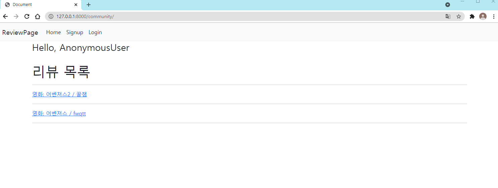
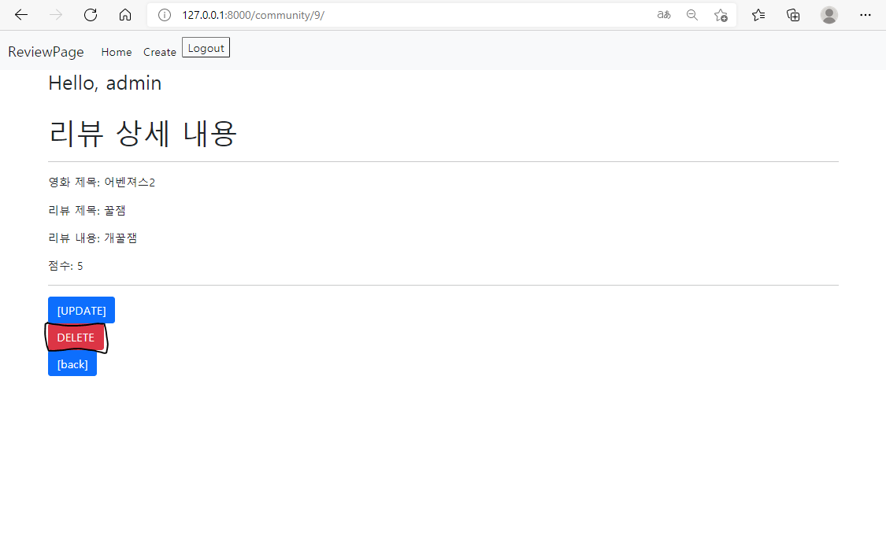
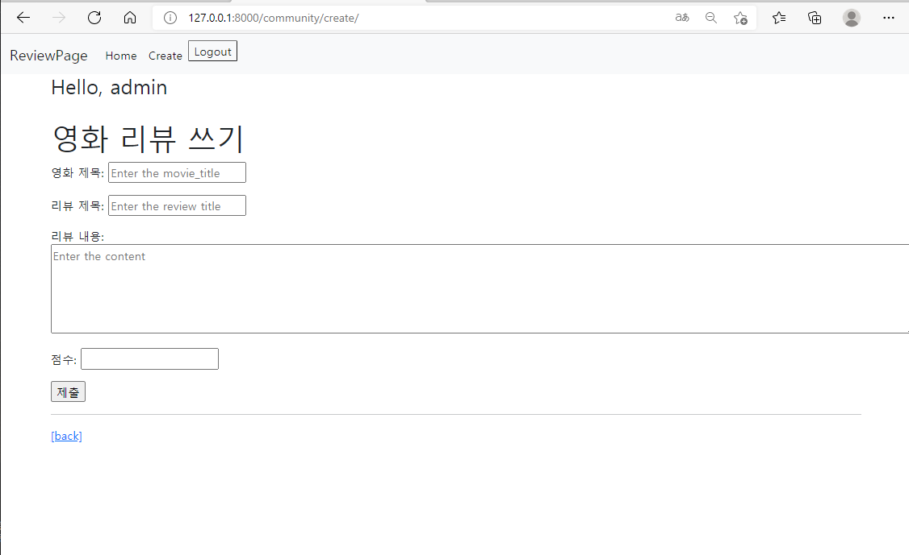
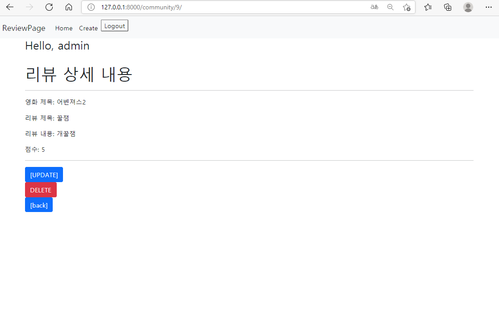
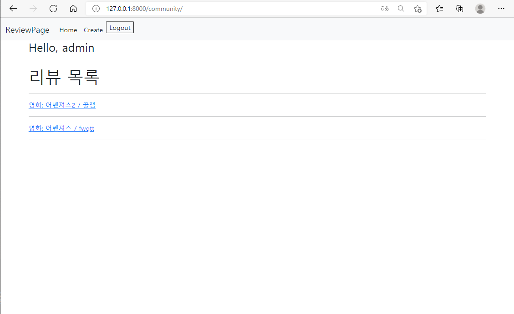
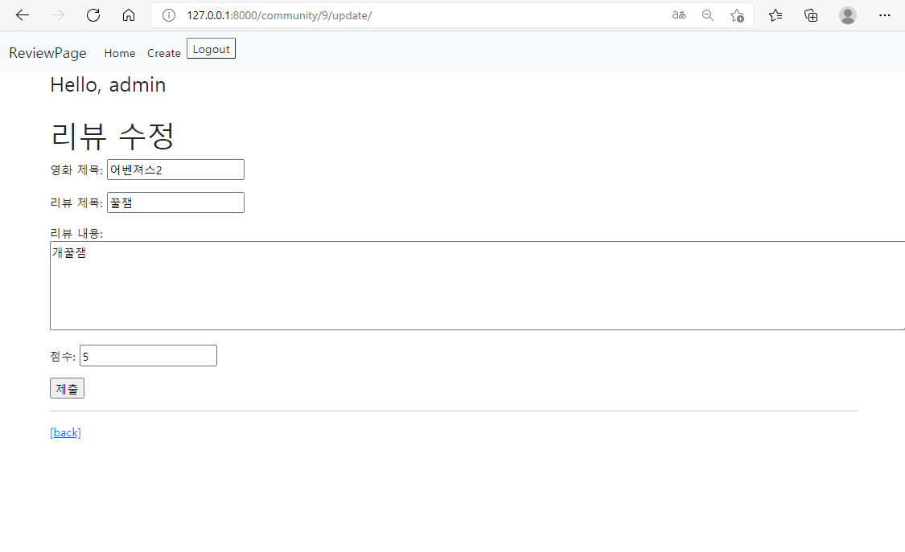
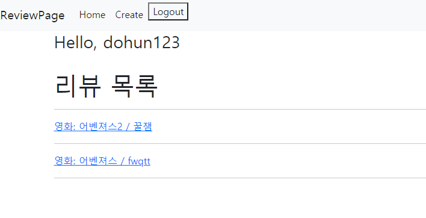
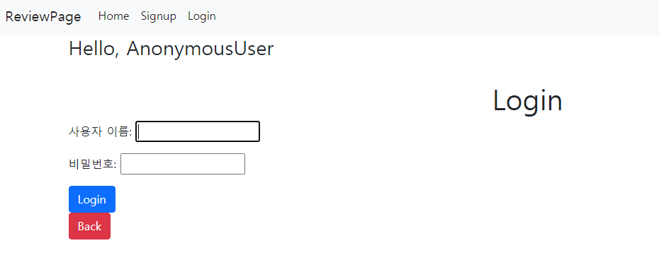
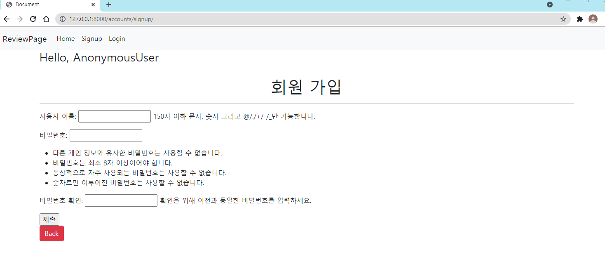

# 🏆210917_PJT 관통프로젝트 6

## 🔎사용자 인증기반 웹 서비스 구현

### 🧭목표

-  데이터를 생성, 조회, 수정, 삭제할 수 있는 Web application 제작
-  Django web framework를 통한 데이터 조작
- Authentication(사용자 인증)에 대한 이해


## 📃문제풀이

### A. 프로젝트 구조(기본 설정)

1. 가상환경 설치

```
$ python -m venv venv
```


2. pip 설치 

- 장고는 기본적으로 설치해야 하고 혹시 몰라서 extensions도 설치했다. 
- requirements 파일에 다운받은 pip를 입력해주었다.

```
$ pip install django django-extensions
$ pip freeze > requirements.txt
```


3. 프로젝트 및 애플리케이션 만들기

- 프로젝트 이름은 pjt06이고 애플리케이션의 이름은 community, accounts이다. 

```
$ django-admin startproject pjt06
$ python manage.py startapp community
$ python manage.py startapp accounts
```


4. settings.py에 설정

- 애플리케이션과 장고 익스텐션을 INSTALLED_APPS에 등록해주었다
- TEMPLATES 에서 base.html을 읽을 수 있도록 BASE_DIR을 등록해주었다.
- 언어와 시간을 한국어, 한국시간으로 맞추었다. 

```
# pjt06/settings.py

...
INSTALLED_APPS = [
    # local
    'community',
    'accounts',

    # third-party
    'django_extensions',

    'django.contrib.admin',
    'django.contrib.auth',
    'django.contrib.contenttypes',
    'django.contrib.sessions',
    'django.contrib.messages',
    'django.contrib.staticfiles',
]

...

TEMPLATES = [
    {
        'BACKEND': 'django.template.backends.django.DjangoTemplates',
        'DIRS': [BASE_DIR / 'templates'],
        'APP_DIRS': True,
        ...
...

LANGUAGE_CODE = 'ko-kr'

TIME_ZONE = 'Asia/Seoul'

...
```


5. base.html 만들기

- 모든 파일은 base.html을 확장하여 사용하기 위해 네비게이션 바와 같이 만들어준다. 
- 사용자가 인증되어 있으면 **리뷰 작성페이지와 로그아웃** 인증되어 있지 않으면 **로그인 페이지와 회원가입** 링크를 표시한다.



```
# templates/base.html

<!DOCTYPE html>
<html lang="en">
<head>
  <meta charset="UTF-8">
  <meta http-equiv="X-UA-Compatible" content="IE=edge">
  <meta name="viewport" content="width=device-width, initial-scale=1.0">
  <link href="https://cdn.jsdelivr.net/npm/bootstrap@5.1.1/dist/css/bootstrap.min.css" rel="stylesheet" integrity="sha384-F3w7mX95PdgyTmZZMECAngseQB83DfGTowi0iMjiWaeVhAn4FJkqJByhZMI3AhiU" crossorigin="anonymous">
  <title>Document</title>
</head>
<body>
  <nav class="navbar navbar-expand-lg navbar-light bg-light">
    <div class="container-fluid">
      <a class="navbar-brand" href="#">
        ReviewPage
      </a>
      <button class="navbar-toggler" type="button" data-bs-toggle="collapse" data-bs-target="#navbarNav" aria-controls="navbarNav" aria-expanded="false" aria-label="Toggle navigation">
        <span class="navbar-toggler-icon"></span>
      </button>
      <div class="collapse navbar-collapse" id="navbarNav">
        <ul class="navbar-nav">
          <li class="nav-item">
            <a class="nav-link active" href="">Home</a>
          </li>
          
            <li>
              <a class="nav-link active" href="">Create</a>
            </li>
            <li class="nav-item">
              <form action="" method="POST">
                
                <input class="text-dark bg-light" type="submit" value="Logout">
              </form>
            </li>
          
            <li>
              <a class="nav-link active" href="">Signup</a>
            </li>
            <li>
              <a class="nav-link active" href="">Login</a>
            </li>
          
        </ul>
      </div>
    </div>
  </nav>
  <div class="container">
    <h3>Hello, {{ request.user }}</h3>
    <br>
    
    
  </div>
  <script src="https://cdn.jsdelivr.net/npm/bootstrap@5.1.1/dist/js/bootstrap.bundle.min.js" integrity="sha384-/bQdsTh/da6pkI1MST/rWKFNjaCP5gBSY4sEBT38Q/9RBh9AH40zEOg7Hlq2THRZ" crossorigin="anonymous"></script>
</body>
</html>
```


6. urls.py 설정

- 프로젝트 url이 애플리케이션 각각의 url로 갈 수 있도록 include를 통해 경로를 만들었다.

```
# pjt06/urls.py

from django.contrib import admin
from django.urls import path, include

urlpatterns = [
    path('admin/', admin.site.urls),
    path('community/', include('community.urls')),
    path('accounts/', include('accounts.urls')),
]
```


### B. Model 설정

- 문제에서 필드명을 movie_title, title, content, rank로 설정하라고 해서 이를 각가 설정해주었다.
- rank는 무제한으로 설정할 수 없게 별점처럼 1-5까지만 할 수 있도록 제한을 두었다.
- admin 페이지에서 영화제목과 리뷰제목이 동시에 나오도록 fstring을 주었다.
- 모델을 설정한 후에 migrate를 해주었다.

```
# community/models.py

from django.db import models
from django.core.validators import MinValueValidator, MaxValueValidator

# Create your models here.
class Review(models.Model):
    movie_title = models.CharField(max_length=100)
    title = models.CharField(max_length=100)
    content = models.TextField()
    rank = models.IntegerField(validators=[MinValueValidator(1), MaxValueValidator(5)])

    def __str__(self):
        return f'{self.movie_title}: {self.title}'
```

```
$ python manage.py makemigrations
$ python manage.py migrate
```


### C. Form 설정

- 문제의 요구대로 forms.py를 만들어 장고의 ModelForm을 사용했다.
- 추가 설정을 통해 폼에 나타나는 movie_title, title, content, rank에 대한 설정을 해주었다.  

```
# community/forms.py

from django import forms
from django.forms.widgets import TextInput
from .models import Review
 
class ReviewForm(forms.ModelForm):
    movie_title = forms.CharField(
        label = '영화 제목',
        widget = forms.TextInput(
            attrs = {
                'class': 'my-moive_title',
                'placeholder': 'Enter the movie_title',
                'maxlength': '100',

            }   
        ),
    )

    title = forms.CharField(
        label = '리뷰 제목',
        widget = forms.TextInput(
            attrs = {
                'class': 'my-title',
                'placeholder': 'Enter the review title',
                'maxlength': '100',

            }   
        ),
    )

    content = forms.CharField(
        label = '리뷰 내용',
        widget = forms.Textarea(
            attrs = {
                'class': 'my-content',
                'placeholder': 'Enter the content',
                'rows': 5,
                'cols': 150,
            }
        ),
        error_messages={
            'required': '내용이 필요합니다'
        },
    )

    rank = forms.IntegerField(
        label = '점수',
        widget = forms.NumberInput(
            attrs = {
                'max_value': '5',
                'min_value': '1',
            } 
        ),
    )

    class Meta:
        model = Review
        fields = '__all__'
        
```


### D. Admin 설정

- 관리자 페이지를 만들기 위해 admin.py에 등록해준다.
- 등록된 글이 Review모델이 들어가도록 해준다.
- 관리자 아이디는 admin으로 등록해준다.

```
# community/admin.py

from django.contrib import admin
from .models import Review

# Register your models here.
admin.site.register(Review)
```

```
# 터미널 창

$ python manage.py createsuperuser
```


### E. URL 설정

1. community url 설정

- 프로젝트의 urls.py를 받고 view로 넘겨주도록 from과 import를 아래와 같이 설정
- app이름은 commuinty로 하고 urlpatterns는 리뷰글 만들기, 리뷰 상세 내용, 리뷰글 수정, 리뷰글 삭제, index를 설정

```
# community/urls.py

from django.urls import path
from . import views

app_name = 'community'
urlpatterns = [
    path('', views.index, name = 'index'),
    path('create/', views.create, name = 'create'),
    path('<int:review_pk>/', views.detail, name = 'detail'),
    path('<int:review_pk>/update/', views.update, name = 'update'),
    path('<int:review_pk>/delete/', views.delete, name = 'delete'),
]
```


2. account url설정

- 회원가입과 로그인 로그아웃을 만든다.

```
app_name='accounts'
urlpatterns = [
    path('signup/', views.signup, name='signup'),
    path('login/', views.login, name='login'),
    path('logout/', views.logout, name='logout'),
]
```


### F. View & Template 설정

1.  community앱의 view

- 장고 내의 여러 모델들을 불러와서 이를 적용시켰다. 
- 리뷰글을 작성, 수정, 삭제는 로그인한 유저들만 사용할 수 있도록 require_safe를 설정했다.
- 수정 페이지의 삭제버튼을 누르면 글이 삭제 된다.



```
# community/view.py

from django import forms
from django.shortcuts import render,redirect, get_object_or_404
from django.views.decorators.http import require_http_methods, require_POST, require_safe
from .models import Review
from .forms import ReviewForm
from django.contrib.auth.decorators import login_required

# Create your views here.
@require_safe
def index(request):
    reviews = Review.objects.order_by('-pk')
    context = {
        'reviews': reviews,
    }
    return render(request, 'community/index.html', context)

    
@require_safe
def detail(request, review_pk):
    review = get_object_or_404(Review, pk =review_pk)
    context = {
        'review': review,
    }
    return render(request, 'community/detail.html', context)

@login_required
@require_http_methods(['GET', 'POST'])
def create(request):
    if request.method == 'POST':
        form = ReviewForm(request.POST)
        if form.is_valid():
            review = form.save()
            return redirect('community:detail', review.pk)
    else:
        form = ReviewForm()
    context = {
        'form': form,
    }
    return render(request, 'community/create.html', context)

@login_required
@require_http_methods(['GET', 'POST'])
def update(request, review_pk):
    review = get_object_or_404(Review, pk = review_pk)
    if request.method == 'POST':
        form = ReviewForm(request.POST, instance = review)
        if form.is_valid():
            form.save()
            return redirect('community:detail', review.pk) 
    else:
        form = ReviewForm(instance = review)
    context = {
        'review': review,
        'form': form,
    }
    return render(request, 'community/update.html', context)

@login_required
@require_POST
def delete(request, review_pk):
    review = get_object_or_404(Review, pk = review_pk)
    if request.method == 'POST':
        review.delete()
        return redirect('community:index')
    else:
        return redirect('community:detail', review.pk)
```


2. community의 html 

- create.html은 form형식을 받아서 출력되도록 한다.
- detail.html은 리뷰의 상세 내용이 나오도록 출력한다.
- index.html은 등록된 review들이 차례대로 나오도록 for문을 사용했다.
- update.html 해당 리뷰에 대해서 form을 받아 작성할 수 있도록 한다.



```
# community/templates/community/create.html




  <h1>영화 리뷰 쓰기</h1>
  <form action="" method="POST">
    
    {{ form.as_p }}
    <input type="submit">
  </form>
  <hr>
  <a href="">[back]</a>

```



```
# community/templates/community/detail.html




  <h1>리뷰 상세 내용</h1>
  <hr>
  <p> 영화 제목: {{ review.movie_title }}</p>
  <p> 리뷰 제목: {{ review.title }}</p>
  <p> 리뷰 내용: {{ review.content }}</p>
  <p> 점수: {{ review.rank }}</p>
  <hr>
  <a href="" class="btn btn-primary">[UPDATE]</a>
  <form action="" method="POST">
    
    <button class="btn btn-danger">DELETE</button>
  </form>
  <a href="" class="btn btn-primary">[back]</a>

```



```
# community/templates/community/index.html




  <h1>리뷰 목록</h1>
  <hr>
   
    <a href="">
    영화: {{ review.movie_title }} / {{ review.title }}
    </a>
    <hr>
  

```



```
# community/templates/community/update.html




  <h1>리뷰 수정</h1>
  <form action="" method="POST">
    
    {{ form.as_p }}
    <input type="submit">
  </form>
  <hr>
  <a href="">[back]</a> 

```


3. accounts의 view

- Signup은 인증된 사용자가 접근할 경우 community 페이지로 넘겨준다.
- auth_login을 통해 회원가입 후에 community 페이지로 넘겨준다.
- Login은 인증된 사용자인 경우 Community로 돌아가고 아닐경우 index로 되돌아가거나 로그인을 진행한다.
- 로그인을 하면 nav창에 로그아웃이 나타난다. 



```
@require_http_methods(['GET', 'POST'])
def signup(request):
    if request.user.is_authenticated:
        return redirect('community:index')

    if request.method == 'POST':
        form = UserCreationForm(request.POST)
        if form.is_valid():
            user = form.save()
            auth_login(request, user)
            return redirect('community:index')
    else:
        form = UserCreationForm()
    context = {
        'form': form,
    }
    return render(request, 'accounts/signup.html', context)


@require_http_methods(['GET', 'POST'])
def login(request):
    if request.user.is_authenticated:
        return redirect('community:index')

    if request.method == 'POST':
        form = AuthenticationForm(request, request.POST)
        if form.is_valid():
            auth_login(request, form.get_user())
            return redirect(request.GET.get('next') or 'community:index')
    else:
        form = AuthenticationForm()
    context = {
        'form': form,
    }
    return render(request, 'accounts/login.html', context)
    

@require_POST
def logout(request):
    if request.user.is_authenticated:
        auth_logout(request)
    return redirect('community:index')
```


4. accounts의 html파일

- 로그인과 가입만 폼형식을 받아서 작성하도록 했다.




```
# accounts/templates/accounts/login.html




  <h1 class="text-center">Login</h1>
  <form action="" method="POST">
    
    {{ form.as_p }}
    <input type="submit" value="Login" class="btn btn-primary">
  </form>
  <a href="" class="btn btn-danger">Back</a>


```



```
# accounts/templates/accounts/signup.html




  <h1 class="text-center">회원 가입</h1>
  <hr>
  <form action=" " method="POST">
    
    {{ form.as_p }}
    <input type="submit">
  </form>
  <a href="" class="btn btn-danger">Back</a>
 
```


## 👍배운점 및 느낀점

1. 김도훈

- 배운점 : 2가지의 App을 각자 나눠서 완성을 한 후에 branch를 사용하여 충돌도 발생해보고 다시 local로 파일을 합치면서 git에 대해서 조금씩 배워나가는 것 같습니다.

  코드작성 중간에 오타 및 빠진부분이 있어서 오류가 많이 발생하였습니다. 🥶

  명재님이 틀린 부분을 많이 찾아주셔서 꼼꼼하게 하는 방법을 많이 배운 것 같습니다. 


- 느낀점 : 지난주와 다르게 3명에서 2명으로 줄었기 때문에 개인적으로 해야하는 부분이 많이 늘었다. 지난주보다 빠르게 하지는 못했지만 배워가는 부분은 더 많다고 생각합니다. 중간에 오타도 조금 있어서 죄송한 부분도 있었고 많이 찾아주셔서 한번 더 점검하고 배울 수 있는 기회가 된 것 같습니다. 시간안에 완성은 하였지만 꾸미지는 못하여서 많이 아쉽고 장고를 조금 더 열심히 연습해서 빠르게 해결할 수 있도록 노력하겠습니다.


2. 최명재

- 배운점: git branch에 대해서 배우고 이를 실행하면서 개발자들이 일하는 방식에 대해서 조금 더 배우게 된 것 같습니다. 하지만 제가 실수로 master에 push를 하는 바람에 깃 충돌이 발생해 배운 것을 제대로 활용하지 못해 아쉬웠습니다.  


- 느낀점: 이번주는 git branch를 배우고 활용해야 해서 지난주처럼 화면공유를 통해 같이 일하는 것이 아니라 업무를 나눠서 작업을 했습니다. 하지만 지난주보다 해야할 일이 많아서 쉽지는 않았던 것 같습니다. 시간이 좀만 더 있었으면 꾸미기도 했을텐데 프로젝트를 끝내고 나니 시간이 얼마 남지 않아서 아쉬웠습니다. 그래도 성공적으로 프로젝트를 마칠 수 있어서 뿌듯했습니다.
