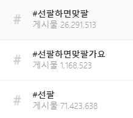
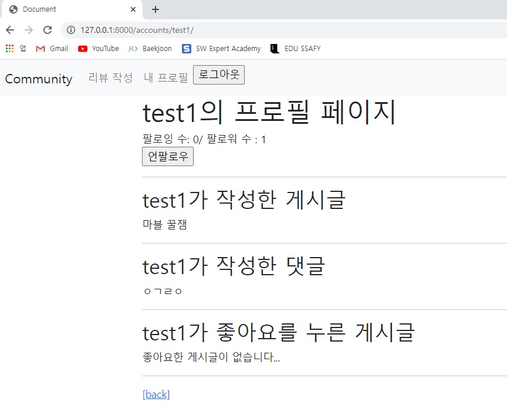
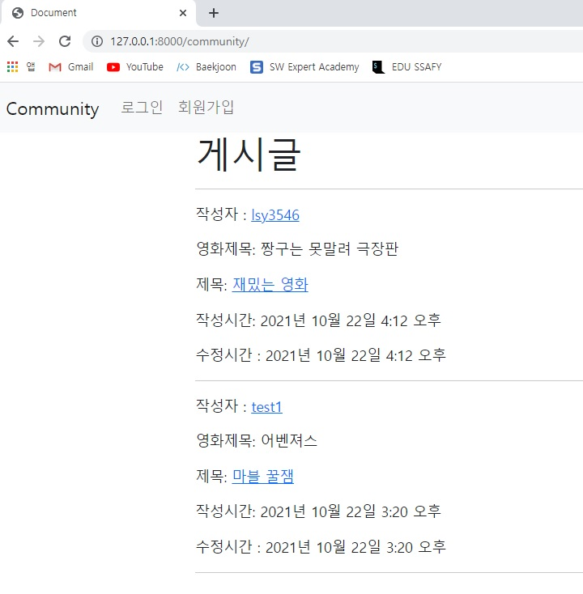
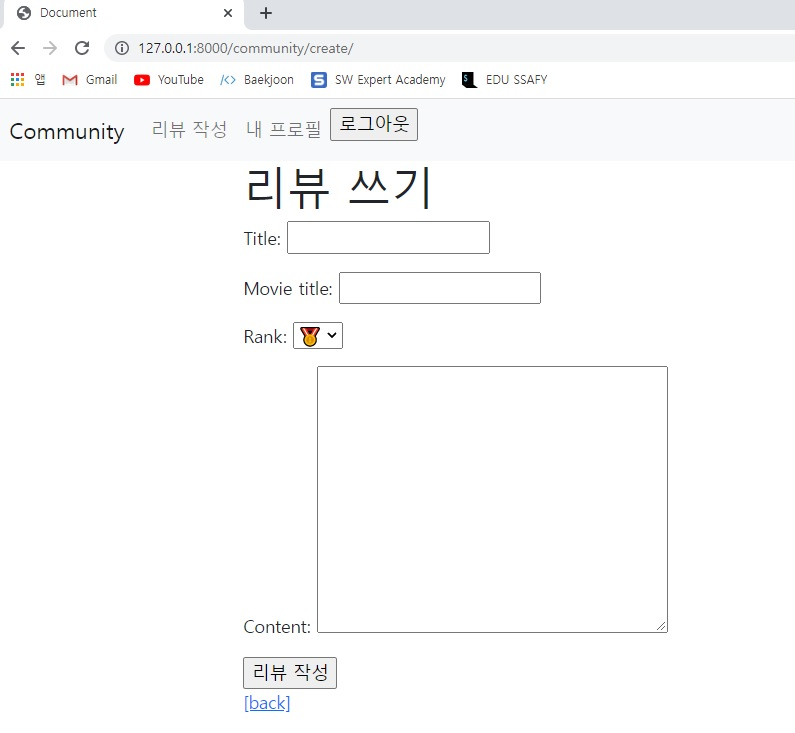
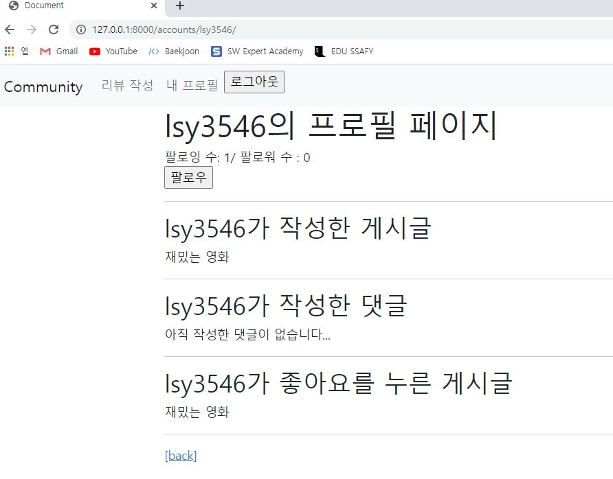
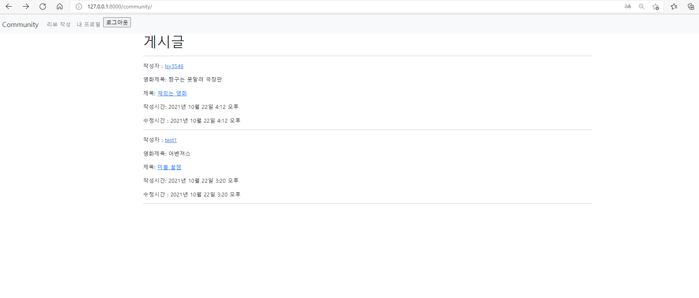
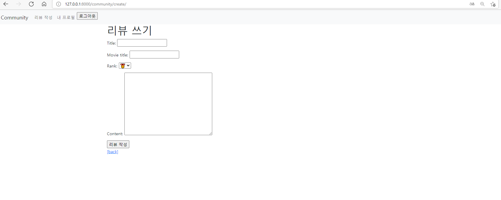
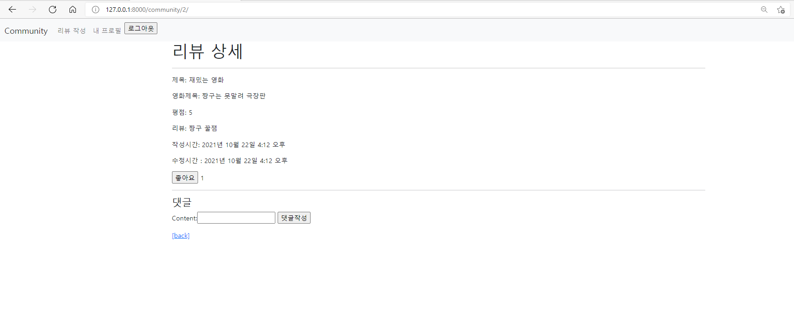

# 선팔시맞팔조

#### 👨‍🚒이상엽(주역할: accounts, base.html 뿌수기)



##### accounts/forms.py

```python
from django import forms
from django.contrib.auth import get_user_model
from django.contrib.auth.forms import UserCreationForm

User = get_user_model()

class CustomUserCreationForm(UserCreationForm):

    class Meta:
        model = User
        fields = UserCreationForm.Meta.fields
```

##### accounts/urls.py

```python
from django.urls import path
from . import views

app_name='accounts'

urlpatterns = [
    path('signup/', views.signup, name='signup'),
    path('login/', views.login, name='login'),
    path('logout/', views.logout, name='logout'),
    path('<str:username>/', views.profile, name='profile'),
    path('<str:username>/follow/', views.follow, name='follow'),
]
```

##### accounts/views.py

```python
from django.shortcuts import render, redirect, get_object_or_404
from django.views.decorators.http import require_http_methods, require_POST, require_safe
from django.contrib.auth import get_user_model
from django.contrib.auth import login as auth_login, logout as auth_logout
from django.contrib.auth.forms import AuthenticationForm
from .forms import CustomUserCreationForm

User = get_user_model()

# Create your views here.
@require_http_methods(['GET', 'POST'])
def signup(request):
    if request.user.is_authenticated:
        return redirect('community:index')
    if request.method == 'POST':
        form = CustomUserCreationForm(request.POST)
        if form.is_valid():
            user = form.save()
            auth_login(request, user)
            return redirect('community:index')
    else:
        form = CustomUserCreationForm()
    context = {
        'form': form,
    }
    return render(request, 'accounts/signup.html', context)

@require_http_methods(['GET', 'POST'])
def login(request):
    if request.user.is_authenticated:
        return redirect('community:index')

    if request.method == 'POST':
        form = AuthenticationForm(request, request.POST)
        if form.is_valid():
            auth_login(request, form.get_user())
            return redirect(request.GET.get('next') or 'community:index')
    else:
        form = AuthenticationForm()
    context = {
        'form': form,
    }
    return render(request, 'accounts/login.html', context)

@require_POST
def logout(request):
    if request.user.is_authenticated:
        auth_logout(request)
    return redirect('community:index')


@require_safe
def profile(request, username):
    profile = get_object_or_404(get_user_model(), username=username)
    is_following = profile.followers.filter(pk=request.user.pk).exists()
    context={
        'profile': profile,
        'is_following': is_following,
    }
    return render(request, 'accounts/profile.html', context)

@require_POST
def follow(request, username):
    if request.user.is_authenticated:
        # follower = request.user
        # following = get_object_or_404(User, username=username)
        person = get_object_or_404(User, username=username)
        if person != request.user:
            if request.user in person.followings.all():
            # if person.followings.filter(username=request.user.pk).exists():
                person.followings.remove(request.user)
            else:
                person.followings.add(request.user)
        return redirect('accounts:profile', person.username)
    return redirect('accounts:login')
```

❗❕😫팔로워에서 아주 많이 헷갈렸다...내가 팔로워인가? 내가 팔로우하는 사람이 팔로워인가 나는 그 사람의 followings인지 followers인지 아주 헷갈렸고 머리가 어질어질했다...

##### accounts/profile.html

```python



  <h1>{{ profile.username }}의 프로필 페이지</h1>
  
    <div>
      <div>팔로잉 수: {{ followers|length }}/ 팔로워 수 : {{ followings|length }}</div>
    </div>
    
      <div>
        <form action="" method="POST">
          
          
            <input type="submit" value='언팔로우'>
          
            <input type="submit" value='팔로우'>
          
        </form>
      </div>
    
  

  <hr>

  <h2>{{ profile.username }}가 작성한 게시글</h2>
  
    <div>{{ review.title }}</div>
  
    <p>아직 작성한 게시글이 없습니다../</p>
  

  <hr>

  <h2>{{ profile.username }}가 작성한 댓글</h2>
  
    <div>{{ comment.content }}</div>
  
    <p>아직 작성한 댓글이 없습니다...</p>
  

  <h2>{{ profile.username }}가 좋아요를 누른 게시글</h2>
  
    <div>{{ review.title }}</div>
  
    <p>좋아요한 게시글이 없습니다...</p>
  

  <a href="">[back]</a>

```

##### Navbar 비로그인시 화면



##### Navbar 로그인시 리뷰 작성 및 내 프로필 화면





##### templates/base.html

```html
<!DOCTYPE html>
<html lang="en">
<head>
  <meta charset="UTF-8">
  <meta http-equiv="X-UA-Compatible" content="IE=edge">
  <meta name="viewport" content="width=device-width, initial-scale=1.0">
  <link href="https://cdn.jsdelivr.net/npm/bootstrap@5.1.0/dist/css/bootstrap.min.css" rel="stylesheet" integrity="sha384-KyZXEAg3QhqLMpG8r+8fhAXLRk2vvoC2f3B09zVXn8CA5QIVfZOJ3BCsw2P0p/We" crossorigin="anonymous">
  <title>Document</title>
</head>
<body>
  <nav class="navbar navbar-expand-lg navbar-light bg-light">
    <div class="container-fluid">
      <a class="navbar-brand" href="">Community</a>
      <button class="navbar-toggler" type="button" data-bs-toggle="collapse" data-bs-target="#navbarNav" aria-controls="navbarNav" aria-expanded="false" aria-label="Toggle navigation">
        <span class="navbar-toggler-icon"></span>
      </button>
      <div class="collapse navbar-collapse" id="navbarNav">
        <ul class="navbar-nav">
          
            <li class="nav-item">
              <a class="nav-link" href="">리뷰 작성</a>
            </li>
            <li class="nav-item">
              <a class="nav-link" href="">내 프로필</a>
            </li>
            <li class="nav-item">
              <form action="" method="POST">
                
                <input type="submit" value="로그아웃">
              </form>
            </li>
          
            <li class="nav-item">
              <a class="nav-link" href="">로그인</a>
            </li>
            <li class="nav-item">
              <a class="nav-link" href="">회원가입</a>
            </li>
          
        </ul>
      </div>
    </div>
  </nav>
  <div class="container">
    
    
  </div>
  <script src="https://cdn.jsdelivr.net/npm/bootstrap@5.1.0/dist/js/bootstrap.bundle.min.js" integrity="sha384-U1DAWAznBHeqEIlVSCgzq+c9gqGAJn5c/t99JyeKa9xxaYpSvHU5awsuZVVFIhvj" crossorigin="anonymous"></script>
</body>
</html>
```


#### 최명재👨‍🚒 (주역할: community 뿌수기)



##### community/models.py

```python
from django.db import models
from django.conf import settings
from django.db.models.deletion import CASCADE

# Create your models here.
class Review(models.Model):
    RANKS = [
        (1, '🎖'),
        (2, '🏅'),
        (3, '🥉'),
        (4, '🥈'),
        (5, '🥇'),
    ]

    user = models.ForeignKey(settings.AUTH_USER_MODEL, on_delete=models.CASCADE)
    title = models.CharField(max_length=100)
    movie_title = models.CharField(max_length=50)
    rank = models.IntegerField(choices=RANKS, default=5)
    content = models.TextField()
    created_at = models.DateTimeField(auto_now_add=True)
    updated_at = models.DateTimeField(auto_now=True)
    like = models.ManyToManyField(settings.AUTH_USER_MODEL, related_name='like_reviews')

    def __str__(self):
        return f'{self.title}'


class Comment(models.Model):
    user = models.ForeignKey(settings.AUTH_USER_MODEL, on_delete=models.CASCADE)
    review = models.ForeignKey(Review, on_delete=models.CASCADE)
    content = models.CharField(max_length=100)

    def __str__(self):
        return f'{self.content}'
```

:sob: ERD를 보고 모델을 짜야해서 테이블을 일일히 확인하면서 짜는 것이 쉽지 않았다.

##### community/forms.py

```python
from django import forms
from .models import Review, Comment

class ReviewForm(forms.ModelForm):

    class Meta:
        model = Review
        exclude = ('user', 'like',)

class CommentForm(forms.ModelForm):

    class Meta:
        model = Comment
        exclude = ('review', 'user', )
```

##### community/urls.py

```python
from django.urls import path
from . import views

app_name = 'community'
urlpatterns = [
    path('', views.index, name='index'),
    path('create/', views.create, name='create'),
    path('<review_pk>/', views.detail, name='detail'),
    path('<review_pk>/comments/create/', views.comments_create, name='comments_create'),
    path('<review_pk>/like/', views.like, name='like'),
]
```

##### community/views.py

```python
from django.shortcuts import render, redirect, get_object_or_404
from django.views.decorators.http import require_http_methods, require_POST, require_safe
from django.contrib.auth.decorators import login_required
from .models import Review, Comment
from .forms import ReviewForm, CommentForm

# Create your views here.
@require_safe
def index(request):
    reviews = Review.objects.order_by('-pk')
    
    context = {
        'reviews': reviews,
    }
    return render(request, 'community/index.html', context)

@login_required
@require_http_methods(['GET', 'POST'])
def create(request):
    if request.method == 'POST':
        form = ReviewForm(request.POST)
        
        if form.is_valid():
            review = form.save(commit=False)
            review.user = request.user
            review.save()
            return redirect('community:detail', review.pk)
    else:
        form = ReviewForm()
    
    context = { 
        'form': form,
    }
    return render(request, 'community/create.html', context)

@require_safe
def detail(request, review_pk):
    review = get_object_or_404(Review, pk=review_pk)
    comment_form = CommentForm()
    comments = review.comment_set.all()
    
    context = {
        'review': review,
        'comment_form': comment_form,
        'comments': comments,
    }
    return render(request, 'community/detail.html', context)

@require_POST
def comments_create(request, review_pk):
    if request.user.is_authenticated:
        review = get_object_or_404(Review, pk=review_pk)
        comment_form = CommentForm(request.POST)
        
        if comment_form.is_valid():
            comment = comment_form.save(commit=False)
            comment.review = review
            comment.user = request.user
            comment.save()
        return redirect('community:detail', review.pk)
    return redirect('accounts:login')

@require_POST
def like(request, review_pk):
    if request.user.is_authenticated:
        review = get_object_or_404(Review, pk=review_pk)

        if review.like.filter(pk=request.user.pk).exists():
            review.like.remove(request.user)
        else:
            review.like.add(request.user)
        return redirect('community:detail', review_pk)
    return redirect('accounts:login')
```

:grinning: 그래도 수업 때 여러 번 해서 그런지 view를 작성하는 것은 그렇게 어렵지 않았다. 

##### community/create.html


```django



  <h1>리뷰 쓰기</h1>
  <form action="" method="POST">
    
    {{ form.as_p }}
    <input type="submit" value="리뷰 작성">
  </form>
   <a href="">[back]</a>

```

##### community/detail.html

```django



  <h1>리뷰 상세</h1>
  <hr>
  <p>제목: {{ review.title }}</p>
  <p>영화제목: {{ review.movie_title }}</p>
  <p>평점: {{ review.rank }}</p>
  <p>리뷰: {{ review.content }}</p>
  <p>작성시간: {{ review.created_at }}</p>
  <p>수정시간 : {{ review.updated_at }}</p>
  
    <form action="" method = "POST">
      
      
        <input type="submit" value="좋아요 취소"> {{ review.like.all | length }}
      
        <input type="submit" value="좋아요"> {{ review.like.all | length }}
      
    </form>
  
  <hr>
  <h4>댓글</h4>
  
  
    <form action="" method="POST">
      
      {{ comment_form }}
      <input type="submit" value="댓글작성">
    </form>
  
    <a href="">[댓글을 작성하려면 로그인해주세요.]</a>
  
  
  <ul>
    
      <li>
        {{ comment.user}}
        {{ comment.content }}
      </li>
    
  </ul>
  
  <a href="">[back]</a>

```

##### community/index.html


```django



  <h1>게시글</h1>
  <hr>
  
    <p>작성자 : 
      <a href="">{{ review.user }}</a>
    </p>
    <p>영화제목: {{ review.movie_title }}</p>
    <p>제목: 
      <a href="">{{ review.title }}</a>
    </p>
    <p>작성시간: {{ review.created_at }}</p>
    <p>수정시간 : {{ review.updated_at }}</p>
    <hr>
  

```

:cry: 해당 페이지에 들어가야할 내용들이 많아서 url과 view를 보면서 경로가 맞는지 확인하는 작업이 은근히 힘들었다. 


## 느낀 점

이상엽👨‍🚒 : 이번 관통프로젝트는  관계형 데이터베이를 설계하는 프로젝트였다. 오전 라이브는 이번 주에 배운 내용을 복습하는 시간이자 더 나아가 DB를 더 효율적으로 활용해 최적화하는 법을 배웠다. 최적화는 아직 무리인 것 같다...ㅎ 배울수록 더 내용이 깊어지는 느낌이다. 이번 프로젝트는 배웠던 내용을 복습하는 느낌이라 크게 어려운 부분은 없었으나 데이터 관계를 설정하는 과정에서 헷갈리는 부분이 좀 생겼다. 다음에 설계할 때는 이런 변수명?과 테이블 이름 설정도 많은 고민을 하고 설정해야겠다라는 느낌을 받았다. 또한, 인스타처럼 실제 우리가 자주 사용하는 커뮤니티가 틀 정도는 완성되는 느낌이라 재밌었다.👻👻👻👻

최명재👨‍🚒 : 오전 라이브에서 기존에 배웠던 관계형 데이터베이스를 설계하는 것에서 더 나아가 DB를 효율적으로 활용하는 방법을 배웠다. 하지만 수업 때 배운 내용을 익히는 것만으로도 쉽지 않아서 나중에 데이터베이스를 더 공부할 때 사용해야겠다는 생각이 들었다. 아직은 무리인듯 하다.... ㅎㅎ 
이번 프로젝트는 전체적인 복습의 느낌이라 크게 어렵지는 않았는데 이전 수업 때와 다른 변수명, 모델명들 등 다른 부분이 조금 있어서 이를 파악하는 것이 약간 어려웠다. 
오늘 프로젝트를 진행하면서 느낀점은 역시 가장 큰 문제는 오타라는 것을 다시 한 번 알게 되었다. 분명 오류가 발생하는데 왜 발생하는지 알기가 힘들다.... 후..... 그래도 이번 프로젝트를 통해서 인스타처럼 웹페이지를 만들어볼 수 있어서 재미있었다.:laughing::laughing::laughing:

