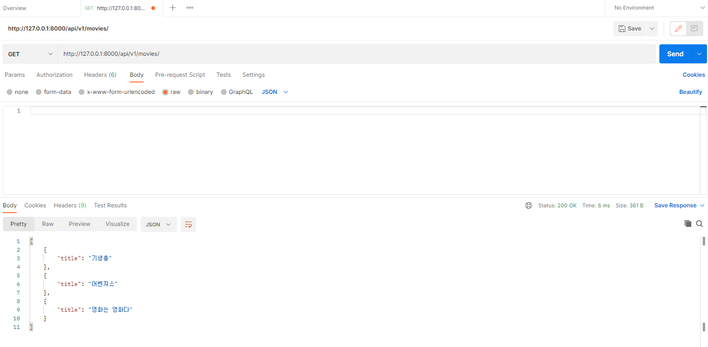
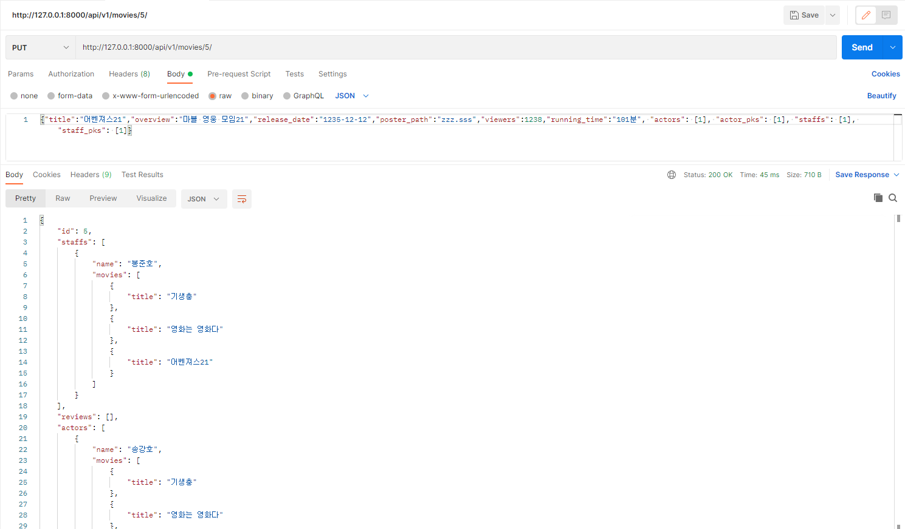

# :film_projector: Pair Project - 08

## A. 기본 설정

### 1. settings.py

```python
...
INSTALLED_APPS = [
    'movies',
    'django_extensions',
    'rest_framework',
    'django.contrib.admin',
    'django.contrib.auth',
    'django.contrib.contenttypes',
    'django.contrib.sessions',
    'django.contrib.messages',
    'django.contrib.staticfiles',
]
...
```

- 애플리케이션 이름은 moives이고 RESTful URL을 만들기 위해서 rest_framework를 설치했다. 


### 2. urls.py

```python
from django.contrib import admin
from django.urls import path, include

urlpatterns = [
    path('admin/', admin.site.urls),
    path('api/v1/', include('movies.urls')),
]

```

- RESTful URL을 만들기 위해서 url 경로에 api/v1이라고 적어주었습니다.
- 그리고 include를 사용하여 movies 애플리케이션과 연결해주었습니다.


## B. Model

### 1. models.py

```python
from django.db import models
from django.core.validators import MaxValueValidator

# Create your models here.
class Actor(models.Model):
    name = models.CharField(max_length=100)

    def __str__(self):
        return self.name

class Staff(models.Model):
    name = models.CharField(max_length=100)

    def __str__(self):
        return self.name

class Movie(models.Model):
    title = models.CharField(max_length=100)
    overview = models.TextField(blank=True)
    release_date = models.DateField(default='1234-12-12')
    poster_path = models.TextField(blank=True)
    viewers = models.PositiveIntegerField(blank=True, default=1234)
    running_time = models.CharField(max_length=10, blank=True)
    actors = models.ManyToManyField(Actor, related_name='movies')
    staffs = models.ManyToManyField(Staff, related_name='movies')

    def __str__(self):
        return self.title

class Review(models.Model):
    movie = models.ForeignKey(Movie, on_delete=models.CASCADE, related_name='reviews')
    title = models.CharField(max_length=100)
    content = models.TextField()
    rank = models.PositiveIntegerField(validators = [MaxValueValidator(10)])
    
    def __str__(self):
        return self.title
```

- ERD를 기반으로 모델을 작성해주었습니다.
- 크게 Actor, Movie, Review 클래스를 만들었고 연습을 위해 Staff 클래스도 만들어보았습니다.
- 클래스 내에는 ERD에 제시된 대로 요소를 넣어주었고 Moive클래스에는 actors와 staffs를 ManyToManyField로 연결해주었습니다.
- Review 클래스 또한 movie를 외래키로 연결해주고 rank의 범위를 PositiveIntegerField와 validator로 0-10까지로 제한해주었습니다.

### 2. ERD:chart:


## C. URL

### 1. urls.py

```python
from django.urls import path
from . import views

app_name = 'movies'
urlpatterns = [
    path('actors/', views.get_actor_all),
    path('actors/<int:actor_pk>/', views.get_actor_detail),
    path('movies/', views.get_movie_all),
    path('movies/<int:movie_pk>/', views.get_movie_detail),
    path('movies/<int:movie_pk>/review/', views.get_review_all),
    path('movies/review/<int:review_pk>/', views.get_review_detail),
    path('staff/', views.get_staff_all),
    path('staff/<int:staff_pk>/', views.get_staff_detail),
]
```

- actors, movies, reviews, staffs를 전체, 개별에 대한 페이지로 연결할 수 있도록 url을 만들어주었습니다.


## D. admin

### 1. admin.py

```python
from django.contrib import admin
from .models import Actor, Movie, Review, Staff

# Register your models here.
admin.site.register(Actor)
admin.site.register(Movie)
admin.site.register(Review)
admin.site.register(Staff)
```

- Actor, Movie, Review, Staff의 데이터 모두 admin 페이지에서 CRUD할 수 있도록 등록해주었습니다.


## E. Serializer & View

### 1. serializers.py

```python
from rest_framework import serializers
from .models import Actor, Movie, Staff, Review

# ActorListSerializer
class ActorListSerializer(serializers.ModelSerializer):

    class Meta:
        model = Actor
        fields = '__all__'

# MovieListSerialize
class MovieListSerializer(serializers.ModelSerializer):

    class Meta:
        model = Movie
        fields = ('title',)

# ReviewListSerializer
class ReviewListSerializer(serializers.ModelSerializer):

    class Meta:
        model = Review
        fields = ('title',)

# StaffListSerializer
class StaffListSerializer(serializers.ModelSerializer):

    class Meta:
        model = Staff
        fields = '__all__'

# ActorSerializer
class ActorSerializer(serializers.ModelSerializer):
    
    class MovieSerializer(serializers.ModelSerializer):
        class Meta:
            model = Movie
            fields = ('title',)

    movies = MovieSerializer(many=True, read_only=True)

    class Meta:
        model = Actor
        fields = ('name', 'movies',)

# ReviewSerializer
class ReviewSerializer(serializers.ModelSerializer):
    
    class MovieSerializer(serializers.ModelSerializer):
        
        class Meta:
            model = Movie
            fields = ('title',)

    movie = MovieSerializer(read_only=True)

    class Meta:
        model = Review
        fields = '__all__'

# StaffSerializer        
class StaffSerializer(serializers.ModelSerializer):
    
    class MovieSerializer(serializers.ModelSerializer):
        class Meta:
            model = Movie
            fields = ('title',)
    
    movies = MovieSerializer(many=True, read_only=True)

    class Meta:
        model = Staff
        fields = ('name', 'movies',)

# MovieSerializer       
class MovieSerializer(serializers.ModelSerializer):
    staffs = StaffSerializer(many=True, read_only=True)
    reviews = ReviewSerializer(many=True, read_only=True)
    actors = ActorSerializer(many=True, read_only=True)
    
    actor_pks = serializers.ListField(write_only=True)
    staff_pks = serializers.ListField(write_only=True)

    def create(self, validated_data):
        actor_pks = validated_data.pop('actor_pks')
        staff_pks = validated_data.pop('staff_pks')
        movie = Movie.objects.create(**validated_data)

        for actor_pk in actor_pks:
            movie.actors.add(actor_pk)

        for staff_pk in staff_pks:
            movie.staffs.add(staff_pk)

        return movie

    def update(self, movie, validated_data):
        actor_pks = validated_data.pop('actor_pks')
        staff_pks = validated_data.pop('staff_pks')

        for attr, value in validated_data.items():
            setattr(movie, attr, value)
            movie.save()

        movie.actors.clear()
        for actor_pk in actor_pks:
            movie.actors.add(actor_pk)

        movie.staffs.clear()
        for staff_pk in staff_pks:
            movie.staffs.add(staff_pk)

        return movie
    
    class Meta:
        model = Movie
        fields = '__all__'
```

- Actor, Movie, Review, Staff의 전체 목록을 출력하도록 OOOListSerializer를 만들어주었습니다. 
- Actor, Staff, Review는 영화 정보를 같이 출력해야 하는데 Actor, Staff, Review에는 영화 관련 정보가 없기 때문에 Actor, Staff, Review의 serializer 안에 MovieSerializer를 선언해주었습니다. 단, 읽기 전용으로 불러오기 위해서 read_only=True를 선언해주었습니다. 그리고 Actor와 Staff는 다른 영화에도 나올 수 있기 때문에 Many=True를 선언해주었습니다.
- 단일 영화 정보는 출연배우, 리뷰 데이터 목록, 스태프를 출력해야 하기 때문에 staffs, reviews, actors를 각각의 Serializer로 받아주었습니다. 그리고 영화 데이터의 생성과 출연배우 등록, 스태프 등록이 가능하도록 serializer 안에 create와 update를 선언했습니다. 


 ### 2. views.py

```python
from .serializers import ActorListSerializer, ActorSerializer, MovieListSerializer, MovieSerializer, ReviewListSerializer, ReviewSerializer, StaffListSerializer, StaffSerializer
from rest_framework import status
from rest_framework.decorators import api_view
from rest_framework.response import Response
from .models import Actor, Movie, Review, Staff
from django.shortcuts import get_list_or_404, get_object_or_404

# Create your views here.
# 전체 목록을 출력하는 함수
def get_serializer_all(request, attr, method, pk=0):
    if method == 'GET':
        if attr == 'actor':
            actors = get_list_or_404(Actor)
            serializer = ActorListSerializer(actors, many=True)
        elif attr == 'movie':
            movies = get_list_or_404(Movie)
            serializer = MovieListSerializer(movies, many=True)
        elif attr == 'staff':
            staffs = get_list_or_404(Staff)
            serializer = StaffListSerializer(staffs, many=True)
        elif attr == 'review':
            reviews = get_list_or_404(Review, pk=pk)
            serializer = ReviewListSerializer(reviews, many=True)

        return Response(serializer.data)

    elif method == 'POST':
        if attr == 'actor':
            serializer = ActorListSerializer(data=request.data)
        elif attr == 'movie':
            serializer = MovieListSerializer(data=request.data)
        elif attr == 'staff':
            serializer = StaffListSerializer(data=request.data)
        elif attr == 'review':
            movie = get_object_or_404(Movie, pk=pk)
            serializer = ReviewListSerializer(data=request.data)
            if serializer.is_valid(raise_exception=True):
                serializer.save(movie=movie)
                return Response(serializer.data, status=status.HTTP_201_CREATED)
        if serializer.is_valid(raise_exception=True):
            serializer.save()
            return Response(serializer.data, status=status.HTTP_201_CREATED)
    
# 단일 개체를 출력하는 함수
def get_serializer_detail(request, attr, method, pk):
    if method == 'GET':
        if attr == 'actor':
            actor = get_object_or_404(Actor, pk=pk)
            serializer = ActorSerializer(actor)
        elif attr == 'movie':
            movie = get_object_or_404(Movie, pk=pk)
            serializer = MovieSerializer(movie)
        elif attr == 'staff':
            staff = get_object_or_404(Staff, pk=pk)
            serializer = StaffSerializer(staff)
        elif attr == 'review':
            review = get_object_or_404(Review, pk=pk)
            serializer = ReviewSerializer(review)

        return Response(serializer.data)

    elif method == 'PUT':
        if attr == 'actor':
            actor = get_object_or_404(Actor, pk=pk)
            serializer = ActorSerializer(actor, data=request.data)
        elif attr == 'movie':
            movie = get_object_or_404(Movie, pk=pk)
            serializer = MovieSerializer(movie, data=request.data)
        elif attr == 'staff':
            staff = get_object_or_404(Staff, pk=pk)
            serializer = StaffSerializer(staff, data=request.data)
        elif attr == 'review':
            review = get_object_or_404(Review, pk=pk)
            serializer = ReviewSerializer(review, data=request.data)
        if serializer.is_valid(raise_exception=True):
            serializer.save()
            return Response(serializer.data)
    
    elif method == 'DELETE':
        if attr == 'actor':
            actor = get_object_or_404(Actor, pk=pk)
            actor.delete()
        elif attr == 'movie':
            movie = get_object_or_404(Movie, pk=pk)
            movie.delete()
        elif attr == 'staff':
            staff = get_object_or_404(Staff, pk=pk)
            staff.delete()
        elif attr == 'review':
            review = get_object_or_404(Review, pk=pk)
            review.delete()

        return Response({'message': 'delete success'}, status=status.HTTP_204_NO_CONTENT)

    
# Actor, Movie, Review, Staff의 데이터를 출력하도록 하는 위의 함수를 연결시켜줌
@api_view(['GET', 'POST'])
def get_actor_all(request):
    return get_serializer_all(request, 'actor', request.method)


@api_view(['GET', 'PUT', 'DELETE'])
def get_actor_detail(request, actor_pk):
    return get_serializer_detail(request, 'actor', request.method, actor_pk)


@api_view(['GET', 'POST'])
def get_movie_all(request):
    return get_serializer_all(request, 'movie', request.method)


@api_view(['GET', 'PUT', 'DELETE'])
def get_movie_detail(request, movie_pk):
    return get_serializer_detail(request, 'movie', request.method, movie_pk)


@api_view(['GET', 'POST'])
def get_review_all(request, movie_pk):
    return get_serializer_all(request, 'review', request.method, movie_pk)


@api_view(['GET', 'PUT', 'DELETE'])
def get_review_detail(request, review_pk):
    return get_serializer_detail(request, 'review', request.method, review_pk)


@api_view(['GET', 'POST'])
def get_staff_all(request):
    return get_serializer_all(request, 'staff', request.method)


@api_view(['GET', 'PUT', 'DELETE'])
def get_staff_detail(request, staff_pk):
    return get_serializer_detail(request, 'staff', request.method, staff_pk)
```

- 알고리즘을 짜는 것하고 비슷하게 코드를 짰습니다. 
- urls.py에서 views.py로 연결하는 경로에 해당하는 함수를 각각 다 선언해주었습니다. 
- 전체 목록을 생성하고 읽어오는 것은 GET, POST만 Method로 가능하고 단일 개체의 CRUD는 GET, PUT, DELETE Method만 받도록 해주었습니다.


## F. 결과물

### 1. Actors

#### 1. GET

- 전체 목록


- 단일 개체


#### 2. POST


#### 3. PUT


#### 4. DELETE


### 2. Moives

#### 1. GET

- 전체 목록




- 단일 개체


#### 2. POST


#### 3. PUT




#### 4. DELETE


### 3. Reviews

#### 1. GET

- 전체목록


- 단일 개체


#### 2. POST


#### 3. PUT


#### 4. DELETE


### 4. Staff

#### 1. GET

- 전체 목록


- 단일 개체


#### 2. POST


#### 3. PUT


#### 4. DELETE


## G. 고찰

:man:임경훈 

 고된 프로젝트였다. api를 사용자에게 제공한다는 것이 이렇게 복잡한 과정을 거쳐야하는구나 라는 것을 느꼈다. 오늘 페어인 명재님과는 첫 페이였는데 꽤나 내 의견을 잘 받아들여주시고 의견제시도 잘 해주셔서 부드럽게 진행이 되었다. 우리는 주어진 과제에 더불어 모델을 추가하고, 필드를 수정하는 등의 추가적인 작업을 하기로 했는데 생각처럼 쉽게 되지않아서 힘들었다. 하지만, 이렇게 욕심을 부려가며 새로운 것을 해보는 것이 결과적으로 내 지식이 되는 것이라고 나는 믿는다. 오늘 제 고집을 잘 들어주신 명재님께 감사하다는 말씀을 드리고싶다.


:person_fencing:최명재

여태까지 해온 프로젝트와는 다르게 쉽지 않았다. html 파일을 만들어서 연결하는 방식이 아니라 RESTful URL 방식을 활용하여 JSON파일로 웹페이지를 작성하는 방식은 구현하는게 쉽지 않았다. 특히 ERD를 만들어서 서로 연결하고 외래키, 1:N, N:N 관계들을 고려해서 모델을 짜고 Serializer를 만드는 것 때문에 머리가 터지는 줄 알았다. 처음 틀은 경훈님 주도로 만들었는데 계속 오류가 나서 이를 해결하는 것이 쉽지 않았다. 사실 오류를 해결했는데 '이게 왜 된거지?'라는 생각도 들었다. 그래서 경훈님과 같이 의논하면서 프로젝트를 진행해 끝낼 수 있었던 거 같다. 이렇게 힘든 프로젝트를 끝내니 성장한 느낌도 들었지만 아직도 갈 길이 멀다는 생각이 들어 공부를 더 열심히 해야겠다는 다짐도 하게 되었다.