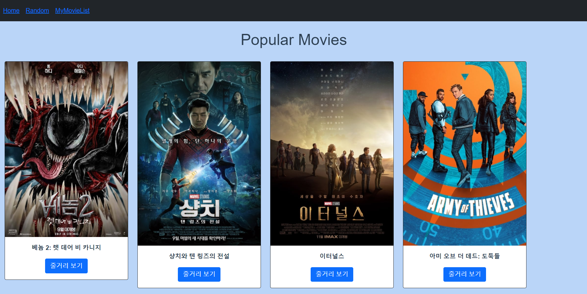
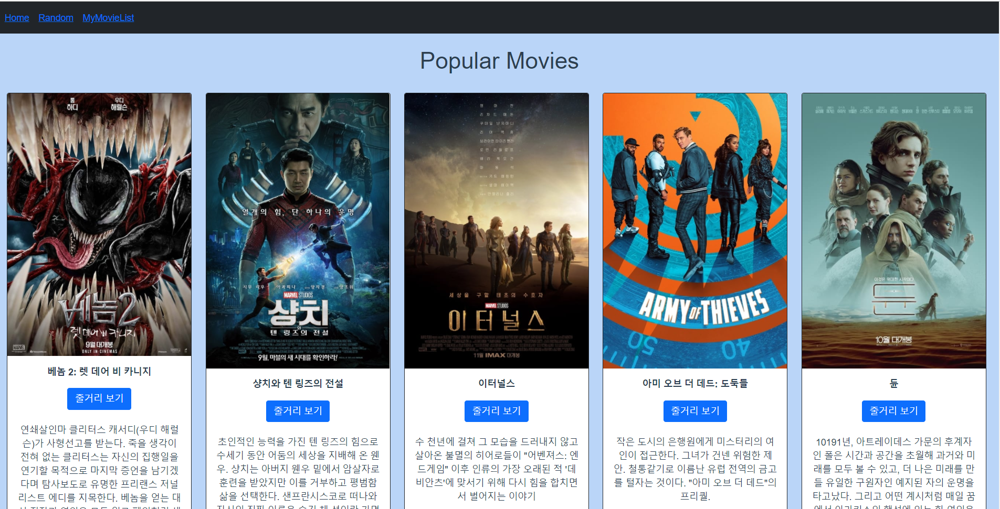
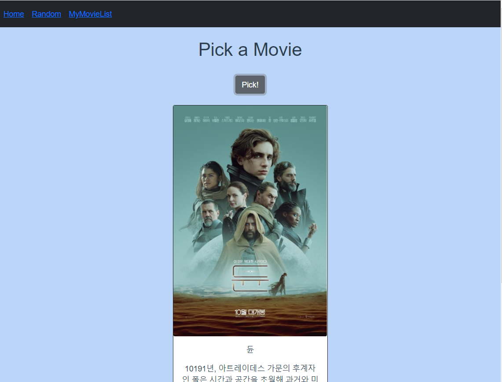
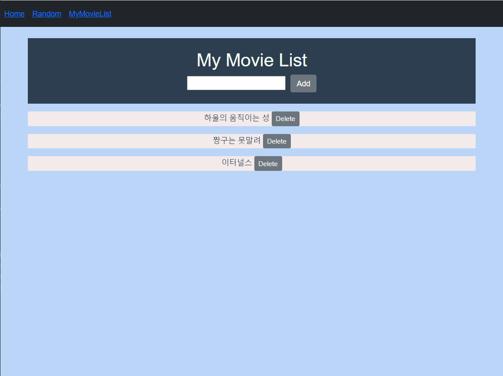

#  🍱🍻관통 프로젝트 10- 소소굉

## ✨ Vue를 활용한  SPA 구성

### 💖 총평

#### 	🐱‍👤 전호정

> 오늘은 마지막 관통 프로젝트다. 다음주 최종 프로젝트도 남아있으니 딱히 마지막이라는 기분은 안든다. 오늘 조이름을 지었는데 소확행+ 수수굉(돈가스맛집) 이 합쳐져  소소하지만 굉장해 라는 뜻으로 '소소굉'이다.😎 이름을 이렇게 지으니 더 열심히 해야할 것 같은 기분이 들었다. 오늘은 Vue 과목에서 배운 걸 다 써먹은 것 같다. router랑 vuex랑 vuex-persistedstate 까지!! 실습에서 꽤 했다고 오늘은 크게 어려운 점은 없었다. 단지 잃어버린 CSS를 찾으러 다니는게,,,힘들었다. 그리고 RANDOM을 구상하는 데 로직이 눈에 바로 들어오진 않아서 조금 시간이 걸렸다. 그래도 명재님과 함께 하니 부족할 걸 채울 수 있었다. 최종을 위해 CSS 공부랑 예쁜 페이지좀 찾아봐야겠다! 우리의 컨셉은..?

#### 	🐱‍👤 최명재

>마지막 관통 프로젝트를 마쳤다. 최종 프로젝트를 앞두고 마지막으로 연습을 해볼 수 있는 프로젝트라서 아쉽기도 하다. 이번 프로젝트는 Vue를 전부 활용할 수 있는 프로젝트였다. router, Vuex, lodash, axios 등 다양한 기능을 활용해서 영화 게시판을 만들었다. 다행히 문제에서 요구하는 기능을 다 구현하고 나서 시간이 좀 남아서 CSS를 활용해서 페이지를 꾸며보았다. 하지만 부트스트랩과 CSS를 한 지 좀 지나서 그런지 까먹었다는... ㅎㅎㅎ 추가 기능을 만들려고 했는데 완성은 못하고 구현했다는 것만으로 타협을 해야 했다 ㅠㅠ 그래서 최종 프로젝트를 대비해서 공부해야겠다는 생각을 했다. 아직 컨셉은 정하지 못했지만 소소굉 화이팅~~!😎

### 🏆 목표

- 영화 정보를 제공하는 SPA 제작

-  AJAX통신과 JSON 구조에 대한 이해
-  Single File Component 구조에 대한 이해
-  vue-cli, vuex, vue-router등 플러그인 활용


### 🎨결과 사진

------

#### 1. HOME





#### 2. RANDOM



#### 3. MyMovieList




###   ⛏ 단계별 구현 과정

#### 1. router

- index.js

  ```js
  import Vue from 'vue'
  import VueRouter from 'vue-router'
  import Home from '../views/Home.vue'
  import Random from '../views/Random.vue'
  import MyMovieList from '../views/MyMovieList.vue'
  
  
  Vue.use(VueRouter)
  
  const routes = [
    {
      path: '/',
      name: 'Home',
      component: Home
    },
    {
      path:'/random',
      name:'Random',
      component:Random
  
    },
    {
      path:'/my-movie-list',
      name:'MyMovieList',
      component:MyMovieList
    }
  ]
  
  const router = new VueRouter({
    mode: 'history',
    base: process.env.BASE_URL,
    routes
  })
  
  export default router
  ```
  
  

------

#### 2. store

- index.js

  ```js
  import Vue from 'vue'
  import Vuex from 'vuex'
  import axios from 'axios'
  
  import createPersistedState from 'vuex-persistedstate'
  
  Vue.use(Vuex)
  
  export default new Vuex.Store({
    plugins:[
      createPersistedState()
    ],
    state: {
      movieCards:[],
      myMovies:[],
    },
    mutations: {
      LOAD_MOVIE_CARDS:function(state,results){
        state.movieCards=results
      },
      CREATE_LIST:function(state,movie){
        state.myMovies.push(movie)
      },
      DELETE_MOVIE:function(state,movie){
        const index=state.myMovies.indexOf(movie)
        state.myMovies.splice(index,1)
      },
      UPDATE_MOVIE:function(state,movie){
        state.myMovies=state.myMovies.map(myMovie=>{
          if(myMovie==movie){
            return{
              ...myMovie,
              isWatched:!movie.isWatched
            }
          }else{
            return myMovie
          }
        })
      }
    },
    actions: {
      LoadMovieCards:function({commit}){
        axios({
          methods:'get',
          url:'https://api.themoviedb.org/3/movie/popular',
          params:{
            api_key:'cf85387cb23102d7dcdbb033efadd2e5',
            language:'ko-kr',
          }
        })
          .then((res)=>{
            console.log(res)
            commit('LOAD_MOVIE_CARDS',res.data.results)
          })
      },
      createList:function({commit},movie){
        commit('CREATE_LIST',movie)
      },
      deleteMovie:function({commit},movie){
        commit('DELETE_MOVIE',movie)
      },
      updateMovie:function({commit},movie){
        console.log(movie)
        commit('UPDATE_MOVIE',movie)
      }
    },
    modules: {
    }
  })
  ```
  

------

#### 3. views

- Home.vue

  ```vue
  <template>
    <div class="home">
      <h1>Popular Movies</h1>
      <div>
        <b-card-group class="center-block">
          <movie-card
            v-for="movieCard in movieCards" 
            :key="movieCard.id" 
            :movieCard="movieCard">
          </movie-card>
        </b-card-group>
      </div> 
    </div>
  </template>
  
  <script>
  // @ is an alias to /src
  import MovieCard from '@/components/MovieCard.vue'
  import {mapState} from 'vuex'
  
  export default {
    name: 'Home',
    components: {
      MovieCard,
    },
    created:function(){
      this.$store.dispatch('LoadMovieCards')
    },
    computed:{
      ...mapState(['movieCards'])
    }
  }
  </script>
  ```
  
- MyMovieList

  ```vue
  <template>
    <div class="container">
      <header class="bg-sky">
        <br>
        <h1 class="text-color">My Movie List</h1>
        <my-list-form></my-list-form>
        <br>
      </header>
        <my-list></my-list>
    </div>
  </template>
  
  <script>
  import MyListForm from '@/components/MyListForm.vue'
  import MyList from '@/components/MyList.vue'
  
  export default {
    name:'MyMovieList',
    components:{
      MyListForm,
      MyList,
    }
  }
  </script>
  
  <style>
  .bg-sky{
    background-color:#2c3e50;
  }
  .text-color{
    color:honeydew;
  }
  
  </style>
  ```

- Random.vue

  ```vue
  <template>
    <div id="app">
      <h1>Pick a Movie</h1>
      <br>
      <b-button @click="showMovie">Pick!</b-button>
        <br>
        <br>
        <div >
          <b-card v-if="pickedMovie"
          :img-src="getMovieImg"
          img-alt="Movie Poster"
          imt-top
          style="max-width: 20rem;"
          class="mb-2 ms-auto me-auto"
          border-variant="dark"
          >
            <b-card-text>
              <p>{{ pickedMovie.title}}</p>
              <p>{{ pickedMovie.overview}}</p>
            </b-card-text>
          </b-card>
          <p v-else> Pick a Movie!!</p>`
        </div>
    </div>
  </template>
  
  <script>
  import {mapState} from 'vuex'
  import _ from 'lodash'
  
  export default {
    name:'Random',
    data: function () {
      return {
        pickedMovie: null,
      }
    },
    computed: {
      ...mapState([
        'movieCards'
      ]),
      getMovieImg: function () {
        const movieImg = this.pickedMovie.poster_path
        return `https://image.tmdb.org/t/p/w500/${movieImg}`
      }
    },
    methods: {
      showMovie: function () {
        this.pickedMovie = _.sample(this.movieCards)
        console.log(this.pickedMovie)
      },
    }
  }
  </script>
  ```

------

#### 4. App

- App.vue

  ```vue
  <template>
    <div id="app">
      <div class="ml-auto" >
        <b-navbar type="dark" variant="dark">
          <b-navbar-nav class="justify-content-end">
            <b-nav-item>
              <router-link to="/">Home</router-link>
            </b-nav-item>
            <b-nav-item>
              <router-link to="/random">Random</router-link> 
            </b-nav-item>
            <b-nav-item>  
              <router-link to="/my-movie-list">MyMovieList</router-link>
            </b-nav-item>
          </b-navbar-nav>
        </b-navbar>
      </div>
      <br>
      <router-view/>
    </div>
  </template>
  
  <style>
  #app {
    font-family: Avenir, Helvetica, Arial, sans-serif;
    -webkit-font-smoothing: antialiased;
    -moz-osx-font-smoothing: grayscale;
    text-align: center;
    color: #2c3e50;
    background-color:rgb(186, 213, 248)
  }
  
  #nav {
    padding: 30px;
  }
  
  #nav a {
    font-weight: bold;
    color: #2c3e50;
  }
  
  #nav a.router-link-exact-active {
    color: #42b983;
  }
  html {
    background-color:rgb(186, 213, 248);
  }
  </style>
  
  ```

------

#### 5. components


- MovieCard.vue

  ```vue
  <template>
    <div>
      <br>
      <div class="container">
        <b-card
          :img-src="getMovieImg"
          img-alt="Movie Poster"
          imt-top
          style="max-width: 20rem;"
          class="mb-2"
          border-variant="dark"
        >
          <b-card-text>
            <p><strong>{{ movieCard.title}}</strong></p>
            <b-button v-b-toggle.overview variant="primary">줄거리 보기</b-button>
            <b-collapse id="overview" class="collapse">
              <br>
              <p>{{ movieCard.overview }}</p>
            </b-collapse>
          </b-card-text>
        </b-card>
      </div>
    </div>
  </template>
  
  <script>
  export default {
    name:'MovieCard',
    props:{
      movieCard:Object,
    },
    computed: {
      getMovieImg: function () {
        const movieImg = this.movieCard.poster_path
        return `https://image.tmdb.org/t/p/w500/${movieImg}`
      }
    }
  }
  </script>
  ```

- MyList.vue

  ```vue
  <template>
    <div>
      <my-list-item
      v-for="myMovie in myMovies" :key="myMovie.date"
      :myMovie="myMovie"
      >
      </my-list-item>
    </div>
  </template>
  
  <script>
  import MyListItem from '@/components/MyListItem.vue'
  import {mapState} from 'vuex'
  
  export default {
    name:'MyList',
    components:{
      MyListItem
    },
    computed:{
      ...mapState(['myMovies'])
    }
  }
  </script>
  ```

- MyListForm.vue

  ```vue
  <template>
    <div>
      <input 
      type="text"
      @keyup.enter="createList"
      v-model.trim="movieTitle">
      <span>' '</span>
      <b-button @click="createList">Add</b-button>
    </div>
  </template>
  
  <script>
  export default {
    name:'MyListForm',
    data:function(){
      return{
        movieTitle:null,
      }
    },
    methods:{
      createList:function(){
        const myMovie={
          title:this.movieTitle,
          isWatched:false,
          date:new Date().getTime()
        }
        if (myMovie.title){
          this.$store.dispatch('createList',myMovie)
        }
        this.movieTitle=null
      }
  
    }
  }
  </script>
  ```

- MyListItem.vue

  ```vue
  <template>
    <div>
      <p></p>
      <div class="list-color">
        <span  @click="updateMovie" :class="{'is-watched':myMovie.isWatched}">{{myMovie.title+' '}}</span>
        <b-button size='sm' @click="deleteMovie">Delete</b-button>
      </div>
    </div>
  </template>
  
  <script>
  export default {
    name:'MyListItem',
    props:{
      myMovie:Object,
    },
    methods:{
      deleteMovie:function(){
        this.$store.dispatch('deleteMovie',this.myMovie)
      },
      updateMovie:function(){
        this.$store.dispatch('updateMovie',this.myMovie)
      }
    }
  }
  </script>
  
  <style>
  .is-watched{
    color: grey;
    text-decoration: line-through;
  }
  .list-color{
    background-color:rgb(243, 234, 234);
  }
  
  </style>
  ```

  
